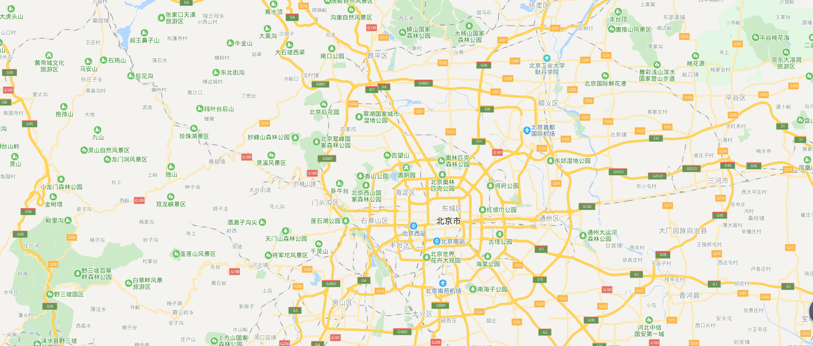
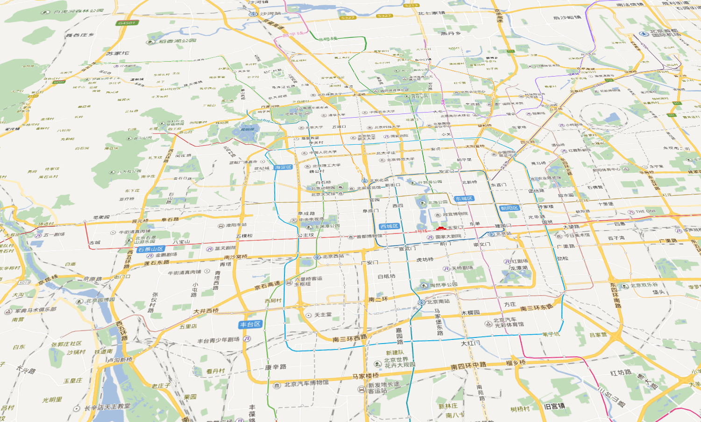
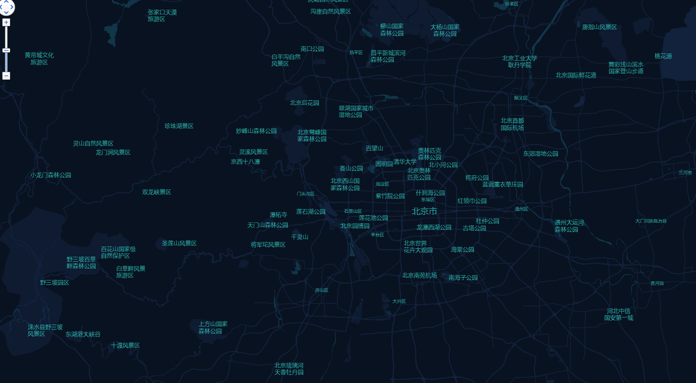

# About-the-map
关于在线地图和离线地图相关的知识和例子  
## 目录
1. 在线百度地图  
    * 在线百度地图比较简单，只需要自己在百度地图开发者注册一个账号，然后添加一个应用的key  
    * 写一个基本的引入地图的例子*Online map*文件夹中
    * 界面截图
    

2. 离线百度地图  
    * 先是将地图瓦片下载下来，下载地图瓦片的软件地址是[这里](https://github.com/jiazheng/BaiduMapTileCutter)
    * 下载一下离线的百度地图api的js文件  
    * 在api的js文件中将引入图片的地址改成你本地放置瓦片图片的地址  
    * 其他的按照在线地图写就可以了
    * 例子在*Offline map*文件夹中
    * 界面截图
    

3. 离线百度地图涉及一些需要引入的模块  
    * 需要注意的是离线地图下载的api的js文件，只是最基础的展现地图的文件，如果需要一些比如空间或者热力图之类的，我们就需要下载文件，在引入到我们的项目中
    * 基础模块的js文件地址[这里](https://lbsyun.baidu.com/index.php?title=jspopular3.0/openlibrary)
    * 例子在*Offline map*文件夹中

4. 离线百度3D地图  
    * 现在在之前的基础上进一步实现3D地图，我们需要设计一个新的知识点[maptalks](http://maptalks.org/),这个可以实现离线3D的地图
    * 需要注意的是这个例子如果在本地使用需要开启服务，我这块是本地开一个tomcat
    * 例子在*Offline 3D map*文件中
    * 界面截图
    

5. 离线自定义百度地图  
    * 这个的目的是有时候我们需求并不是常规的地址，而且可是自定义地图的，这就是需要使用v3.0的api的js文件了，上面的几个都是在2.0的基础上实现，这个我们就可以重新下载api的js文件了
    * 我们需要现在百度地图开发者控制台中的自定义地图上面设置一下自己的地图，然后获取stylejson文件内容，将这个代码放到我们项目中  
    * 目前实现了一开始可以显示自定义地图，但是鼠标增加层级的话还是不能正确显示，这个需要更正一下
    * 两种方法一种是直接使用maptalks中设置，另一种是使用百度离线地图api maptalks这种可以直接在*map*文件夹中，另一种例子待上传
    * 界面截图
    
6. 整合例子
    * 将上面几步整合在一块,注意时刻开着tomcat
    * 例子在*map*文件夹中
    * 界面截图
    
注意：
1. 当使用echarts的创建地图的时候，地图文件不是最新的，所以可能造成误差
    显示下载最新的城市的json文件：http://datav.aliyun.com/tools/atlas/#&lat=33.521903996156105&lng=104.29849999999999&zoom=4 
    比如当前是将两个城市合并成一个城市，那就把两个json文件手动合并在一起，但是手动合并肯定会有重合的线段，这时候需要用 
    https://mapshaper.org/将json文件引入到这个网页，然后打开控制台console，输入命令-clean就可以将重合的线段去掉了 
